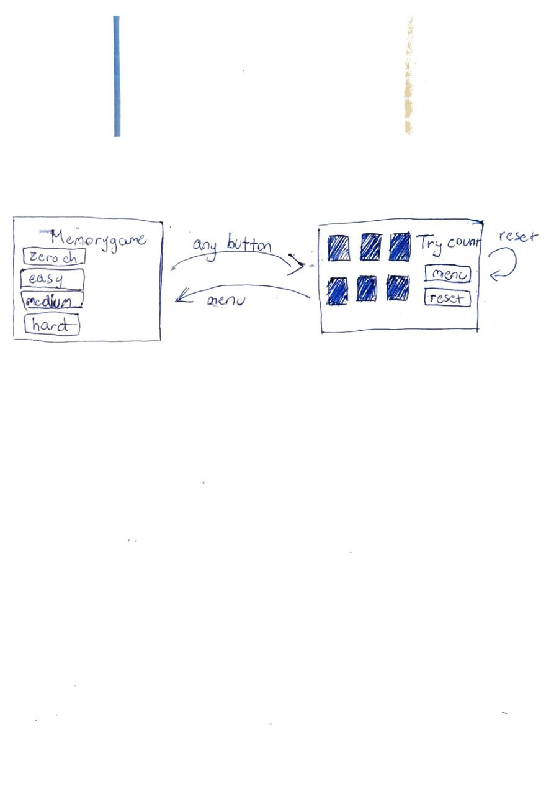

# Määrittelydokumentti

## Sovelluksen tarkoitus
Sovellus on yksinkertainen muistipeli, jossa tarkoitus on löytää parit käännetyistä korteista. Pareja on vaikeustasosta riippuen 1, 3, 6 tai 12.

## Käyttöliittymäluonnos
Sovelluksessa on kaksi eri näkymää.

Sovellus aukeaa menuun, jossa valitaan vaikeustaso neljästä vaihtoehdosta. Valinnan jälkeen näkymä vaihtuu pelinäkymään, josta voi palata takaisin menuun, resetoida pelin (joka luo uuden pelin uusilla pareilla) tai pelin päättyessä pelata uuden pelin samalla vaikeustasolla.

## Toiminnallisuudet
- Ennen pelaamista käyttäjä valitsee vaikeustason
- Vaikeustasosta riippuen valinta vie pelinäkymään, joka aloittaa pelin
- Pelin aikana käyttäjä voi 
    - resetoida pelin, joka aloittaa uuden pelin uusilla pareilla
    - palata takaisin menuun
- Kaikkien parien löydyttyä
    - Käyttäjä voi pelata uudestaan
    - palata aloitusnäkymään valitsemaan toisen vaikeustason

## Jatkokehitysideat
- Kahden pelaajan peli
- Ajastin
- Oma ennätyslista, eli jonkunlainen pisteytysfunktio
