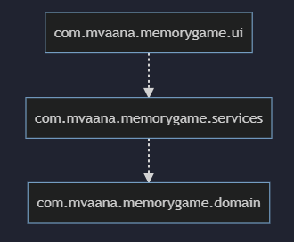
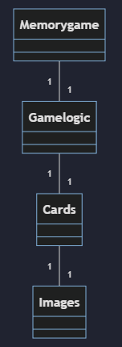
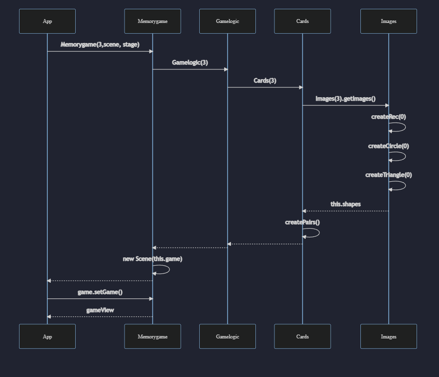
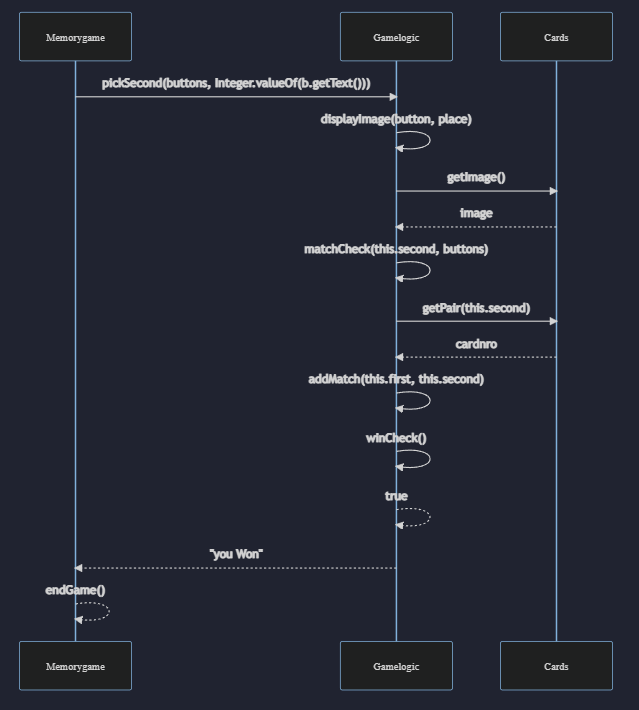

# Arkkitehtuurikuvaus

## Rakenne
Ohjelman rakenne noudattaa kerrosarkkitehtuuria, ja rakenne on oheisen kuvan mukainen:

Pakkaus *com.mvaana.memorygame.ui* sisältää käyttöliittymän näkymät, *com.mvaana.memorygame.services* pelin logiikan ja *com.mvaana.memorygame.domain* yksittäiset logiikan tarvitsemat oliot. Käyttöliittymä on rakennettu paketissa com.mvaana.memorygame.ui, joka sisältää luokat App.java (menunäkymä) ja Memorygame.java (pelinäkymä)

## Käyttöliittymä

Käyttöliittymään kuuluu kaksi näkymää:
- Menu
- Pelinäkymä

Molemmat näkymät on toteutettu Scene-olioina, jotka näkyville tullessaan sijoitetaan sovelluksen stageen. Pelin logiikka on ulkoistettu Gamelogic.java -luokkaan, jonka eri toiminnallisuuksia kutsutaan Memorygame.java -luokan sisältä, käyttäjän painaessa kortteja.

## Sovelluslogiikka
Seuraava kuva kuvaa luokkien välisiä suhteita

Sovelluksen logiikka on käytännössä kokonaan toteutettu luokassa Gamelogic. Nimensä mukaisesti luokka vastaa pelin toiminnallisuuksista, joita kutsutaan Memorygame-luokasta käsin. Pelinäkymässä luodaan yksi Gamelogic-olio, joka luo yhden Cards-olion, ja Cards-olio luo itselleen yhden Images-olion. Images-luokka luo siis kuvat Cards-olion luomille korttipareille. Gamelogic käyttää näitä hyödykseen tarkistaessaan esimerkiksi muodostavatko kaksi käyttäjän valitsemaa korttia parin. Muita Gamelogic-luokan tarjoamia toiminnallisuuksia on:
- void pickFirst(Button[] buttons, int cardnro)
- boolean winCheck()
- void addMatch(int card1, int card2);

## Päätoiminnallisuudet

### 1) Pelin aloitus sekvenssikaaviona

Kun aloitusnäkymässä painetaan "easy"-nappia, ohjelma etenee seuraavasti

Napinpainalluksen jälkeen tapahtumankäsittelijä luo uuden Memorygame-olion parametreinaan parien lukumäärä ja scene ja stage oliot, joihin seuraava näykmä voidaan tallentaa.

Tämän jälkeen pelinäkymälle luodaan pelin logiikka Gamelogic-luokkaa käyttäen, joka edelleen luo pelin kortit, ja niille tarvittavat kuvat parametreinaan parien lukumäärä. 

Cards-luokka arpoo korteille parit createPairs() -metodilla. Tämän jälkeen Memorygame-luokassa luodaan pelinäkymä loppuun ja loppujen lopuksi App-luokan tapahtumankäsittelijä, asettaa näkymän sovellukseen setGame()-metodin avulla.

### Pelin päättyminen

Kun pelissä painetaan viimeistä mahdollista nappia, joka muodostaa viimeisen parin ja pelin päättymisen, ohjelma etenee seuraavasti:

Tapahtumankäsittelijä kutsuu pickSecond()-metodia parametrinaan napit ja painetun napin numero. Tämän jälkeen Gamelogic-luokka piirtää napin kuvan ruudulle ja tarkastaa onko valittu kortti ensimmäisen valitun kortin pari matchCheck()-metodilla. Pari haetaan Cards-luokasta getPair()-metodilla parametrina valitun kortin numero. Metodi palauttaa valitun kortin parin numeron, jonka avulla Gamelogic päättää onko pari löytynyt. Tämän jälkeen löydetty pari lisätään muistiin ja aina parin lisäämisen yhteydessä tarkistetaan onko peli voitettu vai ei. Jos metodi winCheck() palauttaa *true*, matchCheck palauttaa stringin "you won" joka sijoitetaan Memorygame-luokan generoimaan näkymään. Memorygame suorittaa silloin endGame()-metodin, joka tuo näytölle myös "play again" ja "back to menu" painikkeet.

## Sovelluksen heikkoudet

# käyttöliittymä
Pelinäkymä olisi voinut luoda järkevämmin, niin ettei kortit ole nappeja. Tämä olisi luultavasti helpottanut Gamelogic-luokan metodien suunnittelua. Tai edes keksiä keino olla välittämättä Button-komponentteja ollenkaan Gamelogic-oliolle. Lisäksi korttien kääntö vuorojen välissä on hieman epälooginen.

# Sovelluslogiikka
Gamelogic-luokkaa olisi voinut hajauttaa enemmän. Nyt myöhemmin katsoessa sinne on jäänyt metodeita, jotka olisi voinut jättää käyttöliittymäluokan Memorygame.java:n huoleksi.

# Tiedon pysyväistallennus
Tätä en ehtinyt toteuttaa ollenkaan. Ajatuksena oli tallentaa Try counter-labelin tulos jonkinlaiseen highscore-listaan.
