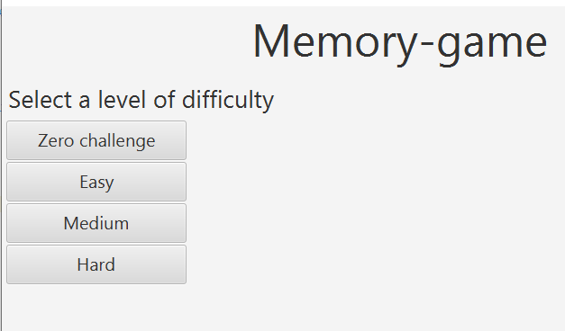
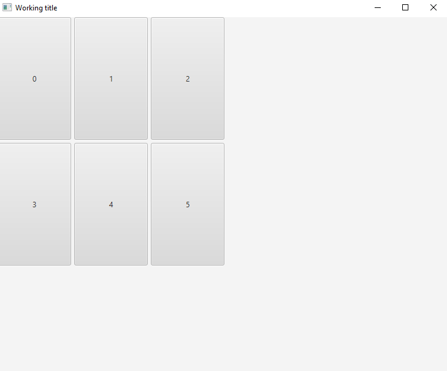
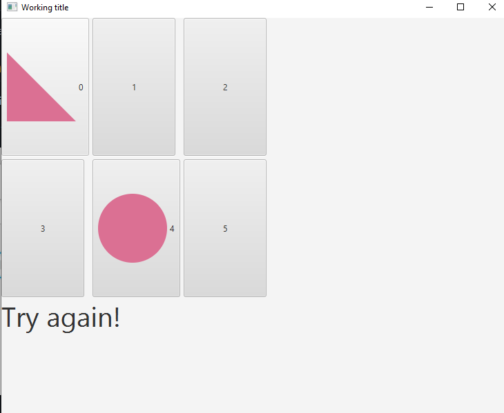
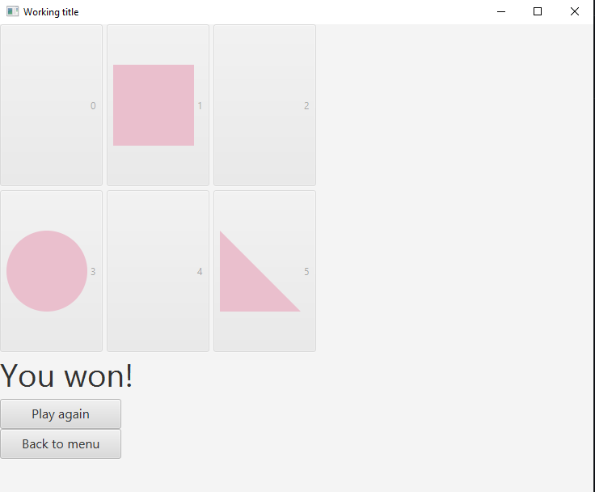

# Käyttöohje

## Ohjelman käynnistys

Jar-tiedosto suoritetaan komentoriviltä komennolla:

``java -jar memorygame-1.0-sshaded.jar``

Saattaa olla, että jar-tiedoston ongelmaa ei ole saatu korjattua, joten saat ohjelman käyttöön kloonaamalla repositorion komennolla

`git clone git@github.com:karppienkingi/ot-harjoitustyo.git`

Tämän jälkeen mene joko luodun kansion sisälle ja suorita komento 
`mvn package`

ja suorita komento `java -jar target/memorygame-1.0-shaded.jar`

tai suorita komentoriviltä projektin juuresta komennolla:
`mvn compile exec:java -Dexec.mainClass=com.mvaana.memorygame.Main`

## Pelin aloitus

Sovellus avautuu pelin menuun, josta voi valita neljästä eri vaikeustasosta mieluisimman.

## Pelaaminen

Vaikeustason valinnan jälkeen avautuu pelinäkymä, jossa nappeja painamalla käännetään kortteja.

## Pelin lopetus

Kaikkien parien löydyttyä pelin voi pelata samalla vaikeustasolla uudestaan tai palata menunäkymään valitsemaan uusi vaikeustaso. Sovellus suljetaan raksista oikeasta yläkulmasta.

