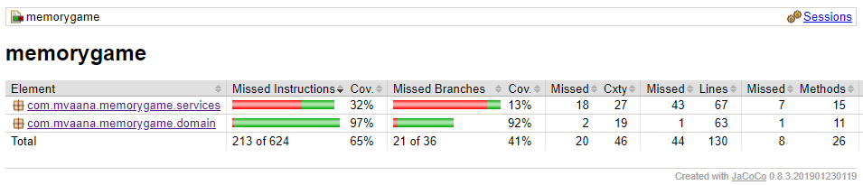

# Testausdokumentti

Sovellusta on testattu yksikkötesteillä JUnitilla.

## JUnit testit
### Sovelluslogiikka
    Gamelogic-luokan testaus jäi vähän vajavaiseksi. Tässä luokassa on testattu, että luokka osaa lopettaa pelin kun kaikki parit on löydetty ja parin lisäys onnistuu oikein.

### Domain-luokat

    Images-luokkaa on testattu, että se luo oikean määrän kuvia.

    Cards-luokassa on testattu, että kaikille korteille luodaan parit, ja että getPair()-metodi palauttaa oikean kortin. Tässä olisi voinut lisäksi testata, että yhdellä kortilla on vain yksi pari.
## Käyttöliittymä
    Käyttöliittymästä vastaavia luokkia App.java ja Memorygame.java on testattu manuaalisesti.

## Testauskattavuus
Käyttöliittymän renderöiviä luokkia lukuunottamatta, testauksen rivikattavuus on 65 ja haarautumakattavuus 41.

Testaamatta jäi Gamelogic-luokan metodit, joihin olisi pitänyt välittää javaFX-komponentti Button. 

## Järjestelmätestaus
Repositorio on kloonattu ja siitä on generoitu jar joka toimii sekä Windows- että Linux-koneilla. Jarin lataus releasesta ei sen sijaan näytä toimivan.

