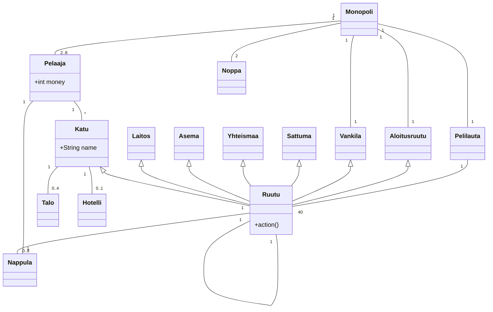

```mermaid
classDiagram
    direction TB
    Monopoli"1" --"1"Pelilauta
    Monopoli"1"--"2..8"Pelaaja
    Monopoli"1"--"2"Noppa
    Monopoli"1"--"1"Aloitusruutu
    Monopoli"1"--"1"Vankila
    Pelilauta"1"--"40"Ruutu
    Pelaaja"1"--"1"Nappula
    Ruutu"1"--"0..8"Nappula
    Ruutu"1"--"1"Ruutu
    Aloitusruutu<|--Ruutu
    Vankila<|--Ruutu
    Sattuma<|--Ruutu
    Yhteismaa<|--Ruutu
    Asema<|--Ruutu
    Laitos<|--Ruutu
    Katu<|--Ruutu
    Pelaaja"1"--"*"Katu
    Katu"1"--"0..4"Talo
    Katu"1"--"0..1"Hotelli
    class Ruutu {
        +action()
    }
    class Katu {
        +String name
    }
    class Pelaaja {
        +int money
    }
```