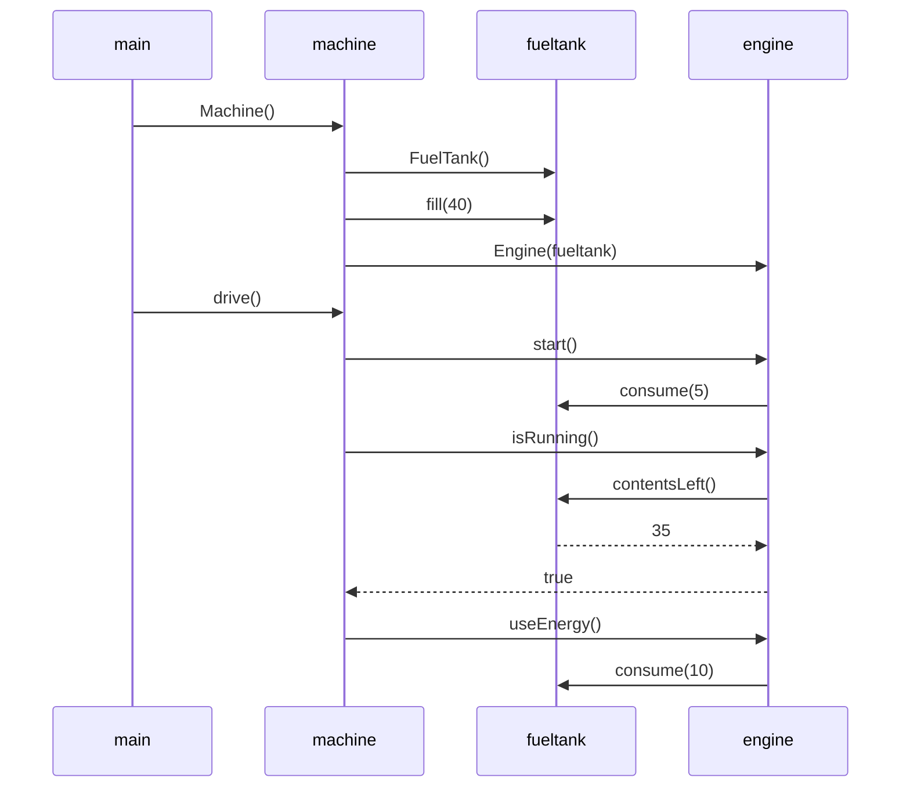

```mermaid
sequenceDiagram
    main->>machine: Machine()
    machine->>fueltank: FuelTank()
    machine->>fueltank: fill(40)
    machine->>engine:Engine(fueltank)
    main->>machine: drive()
    machine->>engine: start()
    engine->>fueltank:consume(5)
    machine->>engine:isRunning()
    engine->>fueltank: contentsLeft()
    fueltank-->>engine: 35
    engine-->>machine: true
    machine->>engine: useEnergy()
    engine->>fueltank: consume(10)
```