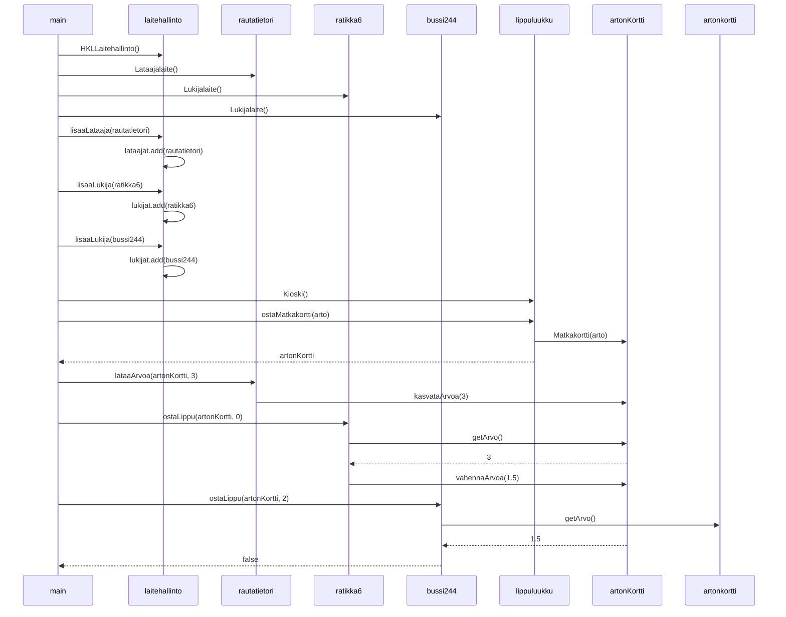

```mermaid
    sequenceDiagram
    main->>laitehallinto: HKLLaitehallinto()
    main->>rautatietori: Lataajalaite()
    main->>ratikka6: Lukijalaite()
    main->>bussi244: Lukijalaite()
    main->>laitehallinto: lisaaLataaja(rautatietori)
    laitehallinto->>laitehallinto: lataajat.add(rautatietori)
    main->>laitehallinto: lisaaLukija(ratikka6)
    laitehallinto->>laitehallinto: lukijat.add(ratikka6)
    main->>laitehallinto: lisaaLukija(bussi244)
    laitehallinto->>laitehallinto: lukijat.add(bussi244)
    main->>lippuluukku: Kioski()
    main->>lippuluukku: ostaMatkakortti(arto)
    lippuluukku->>artonKortti: Matkakortti(arto)
    lippuluukku-->>main: artonKortti
    main->>rautatietori: lataaArvoa(artonKortti, 3)
    rautatietori->>artonKortti: kasvataArvoa(3)
    main->>ratikka6: ostaLippu(artonKortti, 0)
    ratikka6->>artonKortti: getArvo()
    artonKortti-->>ratikka6: 3
    ratikka6->>artonKortti: vahennaArvoa(1.5)
    main->>bussi244: ostaLippu(artonKortti, 2)
    bussi244->>artonkortti: getArvo()
    artonKortti-->>bussi244: 1.5
    bussi244-->>main: false
```